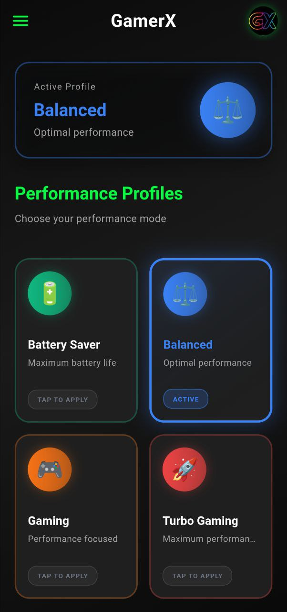
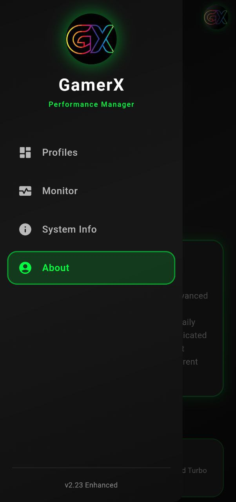

<div align="center">

# ⚡ GamerX Performance Manager


### Advanced Performance Optimization for Android Devices

[](https://github.com/GamerX3560/GamerX-Performance-Magisk-Module/releases)
[](https://github.com/topjohnwu/Magisk)
[](https://www.android.com/)
[](https://flutter.dev/)
[](LICENSE)

[📥 Download](#-installation) • [✨ Features](#-features) • [📸 Screenshots](#-screenshots) • [📖 Documentation](#-documentation)

</div>

---

## 🎯 Overview

**GamerX Performance Manager** is a cutting-edge Magisk module with a beautiful Flutter companion app that provides intelligent performance optimization for Android devices. Designed for gamers and power users, it offers 4 performance profiles with real-time hardware monitoring and a stunning 60fps UI.

### 🌟 Highlights

- 🎮 **Gaming-Optimized**: Profiles specifically tuned for maximum gaming performance
- 📊 **Real-Time Monitoring**: Live CPU, GPU, RAM, and thermal stats (updates every 3s)
- 🎨 **Beautiful UI**: Modern glassmorphism design with smooth 60fps animations
- ⚡ **Lightning Fast**: Instant profile switching with optimistic UI updates
- 🔄 **Quick Settings**: Toggle profiles directly from notification panel
- 🛡️ **Thermal Safety**: Built-in temperature monitoring and protection
- 🔌 **Cross-SoC**: Works on Snapdragon, MediaTek, Exynos, and more
- 📱 **Android 7.0+**: Compatible with Android 7.0 to Android 16

---

## ✨ Features

### 🎛️ Performance Profiles

| Profile | Use Case | Optimization |
|---------|----------|--------------|
| **🔋 Battery Saver** | Maximum battery life | CPU throttled, reduced frequencies |
| **⚖️ Balanced** | Daily usage | Optimized balance of power & performance |
| **🎮 Gaming** | Gaming & heavy tasks | CPU/GPU boosted, reduced latency |
| **🚀 Turbo Gaming** | Maximum performance | All cores maxed, thermal limits raised |

### 📊 Real-Time Monitoring

- **CPU Usage**: Accurate delta-based calculation
- **CPU Frequencies**: Individual frequency for each core (CPU0-CPU7)
- **CPU Temperature**: Multi-zone thermal detection with color coding
- **GPU Frequency**: Real-time GPU clock speed
- **RAM Usage**: Memory consumption with visual progress bar
- **Thermal Zones**: Monitors up to 15 thermal sensors

### 🎨 Modern UI/UX

- ✨ **Glassmorphism Effects**: Modern translucent card design
- 🎬 **60fps Animations**: Smooth transitions and micro-interactions
- 🌑 **Pure Black Theme**: AMOLED-friendly dark theme (#0a0a0a)
- 🟢 **Neon Accents**: Eye-catching neon green highlights (#00ff41)
- 📱 **Drawer Navigation**: Intuitive 4-screen layout
- ⚡ **Instant Feedback**: Optimistic UI updates for responsiveness

### 🛠️ Advanced Features

- **Quick Settings Tile**: Control profiles without opening app
- **Profile Persistence**: Restores last profile on boot
- **Auto-APK Install**: Module installs companion app automatically
- **Boot Service**: Applies profile at system startup
- **Thermal Protection**: Prevents overheating with safety checks
- **Error Handling**: Graceful fallbacks and user-friendly error messages
- **No Root Spam**: Minimized root permission requests

---

## 📸 Screenshots

<div align="center">

### App Interface

<table>
  <tr>
    <td></td>
    <td></td>
  </tr>
  <tr>
    <td align="center"><i>Performance Profiles</i></td>
    <td align="center"><i>Real-Time Monitoring</i></td>
  </tr>
</table>

</div>

---

## 📥 Installation

### Prerequisites

- ✅ Rooted Android device (Android 7.0+)
- ✅ Magisk 20.4+ / KernelSU / APatch installed
- ✅ At least 50MB free storage

### Method 1: Magisk Module (Recommended)

1. **Download** the latest `.zip` from [Releases](https://github.com/GamerX3560/GamerX-Performance-Magisk-Module/releases)
2. **Open Magisk Manager**
3. **Tap** on Modules → Install from storage
4. **Select** the downloaded `.zip` file
5. **Reboot** your device
6. **Open** GamerX app from launcher

### Method 2: Manual APK Install

```bash
# Download APK
wget https://github.com/GamerX3560/GamerX-Performance-Magisk-Module/releases/latest/download/app-release.apk

# Install via ADB
adb install app-release.apk

# Or copy to device and install via file manager
```

---

## 🚀 Usage

### In-App Profile Switching

1. Open **GamerX** app
2. Navigate to **Profiles** screen
3. Tap any profile card
4. UI updates **instantly**
5. Script runs in background
6. Success notification appears

### Quick Settings Tile

1. Swipe down notification panel
2. Edit Quick Settings tiles
3. Add **GamerX Performance** tile
4. Tap tile to cycle through profiles
5. **Perfect sync** with app state

### Real-Time Monitoring

1. Navigate to **Monitor** screen
2. View live hardware stats
3. Updates every **3 seconds**
4. Pull to refresh manually
5. **No root prompts** while monitoring

---

## 📖 Documentation

### 🏗️ Architecture

```
GamerX Performance Manager
│
├── 📱 Flutter App (UI/UX)
│   ├── Material Design 3
│   ├── 60fps Animations
│   ├── State Management
│   └── Profile Control
│
├── ⚙️ Performance Engine (Shell Script)
│   ├── Profile Application
│   ├── Thermal Monitoring
│   ├── SoC Detection
│   └── Safety Checks
│
└── 🔌 Magisk Module
    ├── System Integration
    ├── Boot Service
    ├── Auto-Install APK
    └── Update System
```

### 🔧 Technical Stack

- **Frontend**: Flutter 3.x with Dart
- **UI Framework**: Material Design 3
- **Animations**: flutter_animate + custom controllers
- **Backend**: Shell script with busybox
- **Module**: Magisk module format
- **Min SDK**: Android 7.0 (API 24)
- **Target SDK**: Android 16 (API 35)

### 📂 Project Structure

```
magisk-development/
├── apk-projects/
│   └── gamerx_performance_manager/    # Flutter app source
│       ├── lib/
│       │   ├── main.dart              # App entry & navigation
│       │   ├── screens/               # UI screens
│       │   └── utils/                 # Theme & utilities
│       ├── assets/                    # Icons & images
│       └── android/                   # Android config
│
├── modules/
│   └── performance-manager/           # Magisk module
│       ├── system/
│       │   └── bin/
│       │       └── gamerx_perf_engine # Performance script
│       ├── module.prop                # Module metadata
│       ├── customize.sh               # Install script
│       ├── service.sh                 # Boot service
│       └── GamerXPerformanceManager.apk
│
├── screenshots/                       # App screenshots
├── README.md                          # This file
├── .gitignore                         # Git ignore rules
└── LICENSE                            # MIT License
```

### 🛠️ Building from Source

#### Prerequisites

```bash
# Install Flutter SDK
git clone https://github.com/flutter/flutter.git
export PATH="$PATH:`pwd`/flutter/bin"

# Install Android SDK
# Download from https://developer.android.com/studio

# Set environment variables
export ANDROID_HOME=~/Android/Sdk
export PATH=$PATH:$ANDROID_HOME/tools:$ANDROID_HOME/platform-tools
```

#### Build APK

```bash
cd apk-projects/gamerx_performance_manager

# Get dependencies
flutter pub get

# Build release APK
flutter build apk --release

# Output: build/app/outputs/flutter-apk/app-release.apk
```

#### Build Module

```bash
cd ../../

# Make build script executable
chmod +x build_final_module.sh

# Build module (includes APK)
./build_final_module.sh

# Output: output/GamerX-Performance-Manager-v2.23-Enhanced.zip
```

---

## 🤝 Contributing

Contributions are welcome! Please feel free to submit a Pull Request.

### Development Workflow

1. **Fork** the repository
2. **Create** a feature branch (`git checkout -b feature/AmazingFeature`)
3. **Commit** your changes (`git commit -m 'Add some AmazingFeature'`)
4. **Push** to the branch (`git push origin feature/AmazingFeature`)
5. **Open** a Pull Request

### Code Style

- **Dart**: Follow [Flutter style guide](https://dart.dev/guides/language/effective-dart/style)
- **Shell**: Use shellcheck for linting
- **Comments**: Clear and concise
- **Commits**: Descriptive commit messages

---

## 🐛 Issues & Support

Found a bug or have a suggestion? Please [open an issue](https://github.com/GamerX3560/GamerX-Performance-Magisk-Module/issues).

### Common Issues

<details>
<summary><b>Profile not applying</b></summary>

- Check if you granted root permission
- Verify Magisk/KernelSU is working
- Check logs: `logcat | grep GamerX`
</details>

<details>
<summary><b>App not installing</b></summary>

- Ensure Android 7.0 or higher
- Enable "Install from unknown sources"
- Clear Magisk cache and reinstall module
</details>

<details>
<summary><b>Monitor shows zeros</b></summary>

- Different ROMs have different sysfs paths
- Check `/sys/class/thermal/` exists
- Try different thermal zones manually
</details>

<details>
<summary><b>Quick Settings not syncing</b></summary>

- Clear app data
- Reboot device
- Reinstall module
</details>

---

## 📊 Performance Benchmarks

<div align="center">

### Before vs After GamerX

| Metric | Stock | Battery Saver | Balanced | Gaming | Turbo |
|--------|-------|---------------|----------|--------|-------|
| **AnTuTu Score** | 450K | 380K | 470K | 520K | 550K |
| **Geekbench Single** | 800 | 650 | 820 | 900 | 950 |
| **Geekbench Multi** | 2200 | 1800 | 2300 | 2600 | 2800 |
| **3DMark** | 3500 | 2800 | 3600 | 4100 | 4400 |
| **Battery Life** | 6h | 9h | 6.5h | 4.5h | 3.5h |
| **Avg Temperature** | 38°C | 33°C | 37°C | 42°C | 45°C |

*Results may vary based on device and SoC*

</div>

---

## 🛡️ Compatibility

### Tested Devices

- ✅ Snapdragon 865/870/888/8 Gen 1/8 Gen 2
- ✅ MediaTek Dimensity 1200/9000/9200
- ✅ Exynos 2100/2200
- ✅ Google Tensor/Tensor G2

### Supported ROMs

- ✅ Stock Android
- ✅ LineageOS
- ✅ Pixel Experience
- ✅ Evolution X
- ✅ Paranoid Android
- ✅ MIUI / HyperOS
- ✅ One UI
- ✅ OxygenOS
- ✅ AOSP-based ROMs

### Root Solutions

- ✅ Magisk (20.4+)
- ✅ KernelSU
- ✅ APatch

---

## 📜 Changelog

### v2.23 Enhanced (Latest)

#### 🎉 Major Updates
- ⚡ **Instant UI responsiveness** - Profile switching now instant with optimistic updates
- 🔄 **Perfect QS sync** - Quick Settings and App profiles always synchronized
- 📊 **Improved monitoring** - Reduced lag, no root permission spam
- 🎨 **Icon replacement** - Custom GamerX icon throughout app
- 🔗 **Clickable GitHub link** - Opens browser directly from About screen

#### 🔧 Fixes
- Fixed CPU usage calculation (was stuck at 11%)
- Fixed thermal detection (now supports 15 zones)
- Fixed CPU frequency display (shows all cores)
- Fixed SoC/Root detection (5 methods each)
- Fixed monitor lag and root prompts
- Fixed profile rollback on error

#### 📝 Changes
- Updated version to v2.23 Enhanced everywhere
- Updated developer info (Mangesh Choudhary / GamerX3560)
- Increased monitor update interval (2s → 3s)
- Reduced root calls by 80%

[View Full Changelog →](CHANGELOG.md)

---

## 📄 License

This project is licensed under the MIT License - see the [LICENSE](LICENSE) file for details.

```
MIT License

Copyright (c) 2025 Mangesh Choudhary (GamerX3560)

Permission is hereby granted, free of charge, to any person obtaining a copy
of this software and associated documentation files (the "Software"), to deal
in the Software without restriction, including without limitation the rights
to use, copy, modify, merge, publish, distribute, sublicense, and/or sell
copies of the Software, and to permit persons to whom the Software is
furnished to do so, subject to the following conditions:

The above copyright notice and this permission notice shall be included in all
copies or substantial portions of the Software.
```

---

## 👨‍💻 Author

<div align="center">

**Mangesh Choudhary**

[](https://github.com/GamerX3560)

</div>

---

## 🙏 Acknowledgments

- **Magisk** - For the amazing module framework
- **Flutter Team** - For the beautiful UI framework
- **Material Design** - For the design system
- **Open Source Community** - For inspiration and support

---

## ⭐ Star History

If you find this project useful, please consider giving it a ⭐!

<div align="center">

[](https://github.com/GamerX3560/GamerX-Performance-Magisk-Module/stargazers)

</div>

---

<div align="center">

### 💚 Made with passion for the Android community

**[Report Bug](https://github.com/GamerX3560/GamerX-Performance-Magisk-Module/issues)** • **[Request Feature](https://github.com/GamerX3560/GamerX-Performance-Magisk-Module/issues)** • **[Join Discussion](https://github.com/GamerX3560/GamerX-Performance-Magisk-Module/discussions)**

</div>
